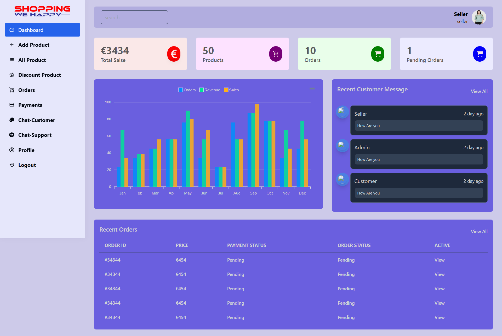
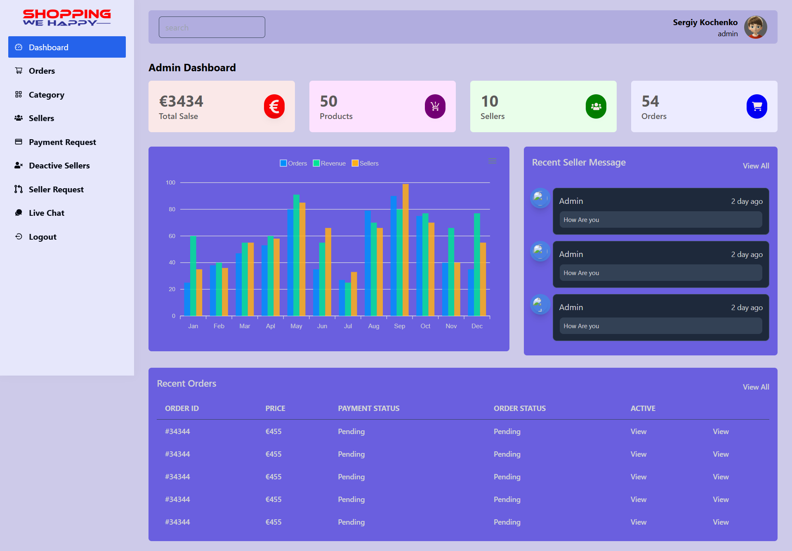

# Ecommerce Dashboard

An admin and seller dashboard for managing an ecommerce platform. Built with React, Redux, React Router, and Tailwind CSS.

---

## Table of Contents

- [Ecommerce Dashboard](#ecommerce-dashboard)
  - [Table of Contents](#table-of-contents)
  - [Overview](#overview)
  - [Features](#features)
  - [Screenshots](#screenshots)
  - [Project Structure](#project-structure)
  - [Getting Started](#getting-started)
    - [Prerequisites](#prerequisites)
    - [Installation](#installation)
    - [Building for Production](#building-for-production)
    - [Running Tests](#running-tests)
  - [Backend Setup](#backend-setup)
  - [Admin \& Seller Features](#admin--seller-features)
    - [Admin](#admin)
    - [Seller](#seller)
  - [Packages Used](#packages-used)
  - [Available Scripts](#available-scripts)
  - [Contributing](#contributing)
  - [Recommended VS Code Extensions](#recommended-vs-code-extensions)

---

## Overview

Ecommerce Dashboard is a web application for managing products, users, orders, and more in an ecommerce platform. It provides separate interfaces for admins and sellers, with authentication and protected routes. The project leverages React for the frontend, Redux for state management, and Tailwind CSS for styling.

---

## Features

- User authentication (Login, Register)
- Protected routes for admin and seller
- Responsive layout with sidebar and header
- Modular routing and navigation
- State management with Redux
- Styled with Tailwind CSS
- Real-time chat (socket.io)
- Product, order, and category management
- Seller onboarding and management
- Admin dashboard with analytics

---

## Screenshots

_Seller dashboard screenshot._



_Admin dashboard screenshot._



---

## Project Structure

```
src/
  api/           # API utilities
  layout/        # Layout components (Header, Sidebar, MainLayout)
  navigation/    # Navigation configs
  router/        # Routing logic and route definitions
  store/         # Redux store and reducers
  utils/         # Utility functions
  views/
   auth/        # Auth pages (Login, Register)
   admin/       # Admin dashboard pages
   seller/      # Seller dashboard pages
   components/  # Reusable components
   pages/       # Main dashboard pages
public/          # Static files
build/           # Production build output
```

---

## Getting Started

### Prerequisites

- Node.js (v16 or higher recommended)
- npm

### Installation

1. Clone the repository:

```bash
git clone <repo-url>
cd dashboard
```

2. Install dependencies:

```bash
npm install
```

3. Start the development server:

```bash
npm start
```

The app will be available at [http://localhost:3001](http://localhost:3001).

### Building for Production

To create a production build:

```bash
npm run build
```

The output will be in the `build/` directory.

### Running Tests

To run tests:

```bash
npm test
```

---

## Backend Setup

This project requires a backend server for full functionality (authentication, data storage, etc.).

**Recommended steps:**

1. Clone or set up your backend repository (Node.js/Express, Django, etc.) in a separate folder.
2. Configure environment variables (e.g., API URLs, database credentials) as needed for your backend.
3. Start the backend server (commonly with `npm run start` or `npm run dev` for Node.js backends).
4. Update API endpoints in the frontend (see `src/api/api.js`) to match your backend server's URL (e.g., `http://localhost:5000/api`).

> **Note:** This frontend is decoupled from the backend. You can use any backend technology as long as the API contracts match.

---

## Admin & Seller Features

### Admin

- Login/logout
- Dashboard overview
- Manage sellers (approve, deactivate, view details)
- Manage products and categories
- View and manage orders
- Handle payment requests
- Chat with sellers

### Seller

- Login/logout
- Dashboard overview
- Add, edit, and manage products
- View and manage orders
- Request payments
- Chat with admin and customers
- Profile management

---

## Packages Used

- **apexcharts** / **react-apexcharts** (charts & analytics)
- **axios** (HTTP requests)
- **jwt-decode** (JWT parsing)
- **moment** (date/time formatting)
- **react-hot-toast** (notifications)
- **react-icons** (icon library)
- **@reduxjs/toolkit** / **react-redux** (state management)
- **redux-thunk** (async Redux actions)
- **react-spinners** (loading spinners)
- **react-window** (virtualized lists)
- **socket.io-client** (real-time communication)

---

## Available Scripts

In the project directory, you can run:

- `npm start` — Runs the app in development mode.
- `npm test` — Launches the test runner.
- `npm run build` — Builds the app for production.
- `npm run eject` — Ejects the app (not reversible).

See [Create React App documentation](https://facebook.github.io/create-react-app/docs/getting-started) for more details.

---

## Contributing

Pull requests are welcome. For major changes, please open an issue first to discuss what you would like to change.

---

## Recommended VS Code Extensions

- **ES7+ React/Redux/React-Native snippets**
- **Prettier - Code formatter**
- **ESLint**
- **Simple React Snippets**
- **GitLens — Git supercharged**

These extensions help with code formatting, linting, and productivity when working with React projects.

- **ESLint**
- **Simple React Snippets**
- **GitLens — Git supercharged**

These extensions help with code formatting, linting, and productivity when working with React projects.
